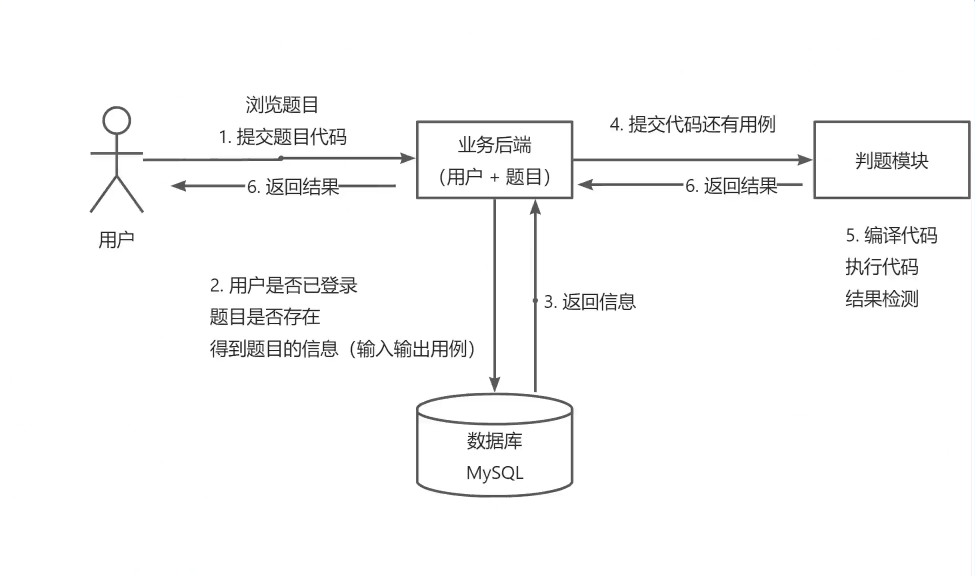
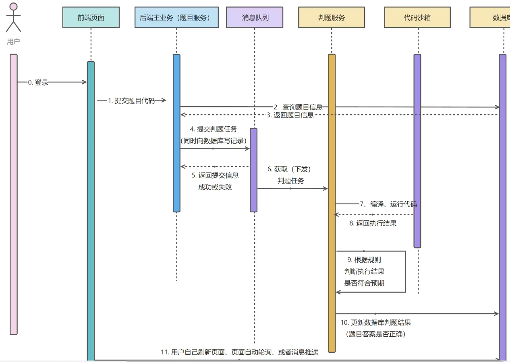
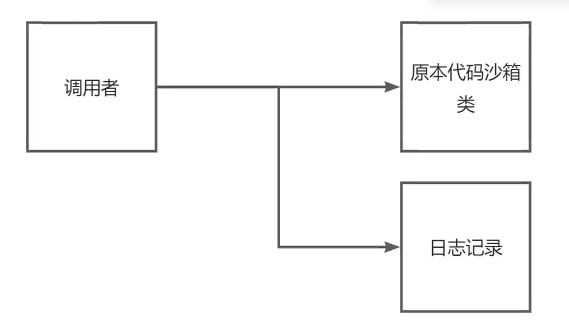
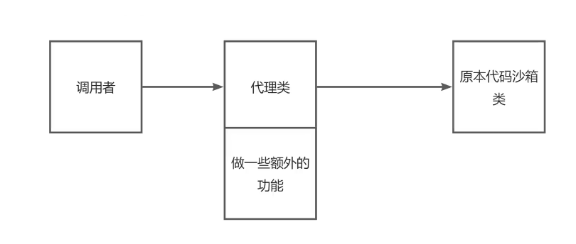
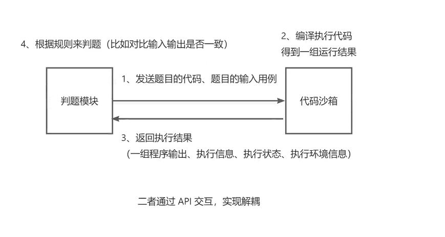

# SpringBoot 项目初始模板

基于 Java SpringBoot 的项目初始模板，整合了常用框架和主流业务的示例代码。

只需 1 分钟即可完成内容网站的后端！！！大家还可以在此基础上快速开发自己的项目。

[toc]

## 模板特点

### 主流框架 & 特性

- Spring Boot 2.7.x（贼新）
- Spring MVC
- MyBatis + MyBatis Plus 数据访问（开启分页）
- Spring Boot 调试工具和项目处理器
- Spring AOP 切面编程
- Spring Scheduler 定时任务
- Spring 事务注解

### 数据存储

- MySQL 数据库
- Redis 内存数据库
- Elasticsearch 搜索引擎
- 腾讯云 COS 对象存储

### 工具类

- Easy Excel 表格处理
- Hutool 工具库
- Gson 解析库
- Apache Commons Lang3 工具类
- Lombok 注解

### 业务特性

- Spring Session Redis 分布式登录
- 全局请求响应拦截器（记录日志）
- 全局异常处理器
- 自定义错误码
- 封装通用响应类
- Swagger + Knife4j 接口文档
- 自定义权限注解 + 全局校验
- 全局跨域处理
- 长整数丢失精度解决
- 多环境配置


## 业务功能

- 提供示例 SQL（用户、帖子、帖子点赞、帖子收藏表）
- 用户登录、注册、注销、更新、检索、权限管理
- 帖子创建、删除、编辑、更新、数据库检索、ES 灵活检索
- 帖子点赞、取消点赞
- 帖子收藏、取消收藏、检索已收藏帖子
- 帖子全量同步 ES、增量同步 ES 定时任务
- 支持微信开放平台登录
- 支持微信公众号订阅、收发消息、设置菜单
- 支持分业务的文件上传

### 单元测试

- JUnit5 单元测试
- 示例单元测试类

### 架构设计

- 合理分层


## 快速上手

> 所有需要修改的地方鱼皮都标记了 `todo`，便于大家找到修改的位置~

### MySQL 数据库

1）修改 `application.yml` 的数据库配置为你自己的：

```yml
spring:
  datasource:
    driver-class-name: com.mysql.cj.jdbc.Driver
    url: jdbc:mysql://localhost:3306/my_db
    username: root
    password: 123456
```

2）执行 `sql/create_table.sql` 中的数据库语句，自动创建库表

3）启动项目，访问 `http://localhost:8101/api/doc.html` 即可打开接口文档，不需要写前端就能在线调试接口了~


### Redis 分布式登录

1）修改 `application.yml` 的 Redis 配置为你自己的：

```yml
spring:
  redis:
    database: 1
    host: localhost
    port: 6379
    timeout: 5000
    password: 123456
```

2）修改 `application.yml` 中的 session 存储方式：

```yml
spring:
  session:
    store-type: redis
```

3）移除 `MainApplication` 类开头 `@SpringBootApplication` 注解内的 exclude 参数：

修改前：

```java
//@SpringBootApplication(exclude = {RedisAutoConfiguration.class}
```

修改后：


```java
//@SpringBootApplication
```

### Elasticsearch 搜索引擎

1）修改 `application.yml` 的 Elasticsearch 配置为你自己的：

```yml
spring:
  elasticsearch:
    uris: http://localhost:9200
    username: root
    password: 123456
```

2）复制 `sql/post_es_mapping.json` 文件中的内容，通过调用 Elasticsearch 的接口或者 Kibana Dev Tools 来创建索引（相当于数据库建表）

```
PUT post_v1
{
 参数见 sql/post_es_mapping.json 文件
}
```

这步不会操作的话需要补充下 Elasticsearch 的知识，或者自行百度一下~

3）开启同步任务，将数据库的帖子同步到 Elasticsearch

找到 job 目录下的 `FullSyncPostToEs` 和 `IncSyncPostToEs` 文件，取消掉 `@Component` 注解的注释，再次执行程序即可触发同步：

```java
// todo 取消注释开启任务
//@Component
```


# 判题后端笔记
# 核心业务流程，时序图（执行流程）


## day1
初始化模板，创建登录接口，题目增删改查接口，题目提交接口 规范开发规则
前端传来的值通过request实体类封装，后端返回的值通过VO类封装 同时数据区分脱敏和不脱敏两种 和登录的用户权限进行挂钩

## day2
判题机模块预开发：目的跑通完整的业务流程

代码沙箱开发
编写单元测试，验证单个代码沙箱的执行  CodeSandbox codeSandbox = new ExampleCodeSandbox();
但是如果这么做，就把new某个沙箱的代码写死了，如果后面项目要改用其他沙箱，可能要改很多地方的代码
所以这里使用 工厂模式，根据用户传入的字符串参数，来生成对应的代码沙箱实现类 CodeSandboxFactory
进一步 把这里做成参数配置话，把项目中的一些可以交给用户去自定义的选项或字符串，写到配置文件中 application.yml:codesandbox
使用代理模式，增强代码沙箱能力，比如日志输出 CodeSandboxProxy
原本需要用户自己打印日志：


使用代理后，不仅仅不用改变原本的代码沙箱实现类，而且对调用者来说，调用方式几乎没有变，也不需要再每个调用


判题使用策略模式

### 判题模块和代码沙箱的关系
判题模块：调用代码沙箱，把代码和输入交给代码沙箱去执行
代码沙箱：只负责接收代码和输入，返回编译运行结构，不负责判题（可以作为独立的项目/服务，提供给其他需要执行代码的项目去使用）
这两个模块完全解耦

确保代码沙箱要接收和输出一组运行用例，因为如果每个用例单独调用一次代码沙箱，会调用多次接口，需要多次网络传输，程序要多次编译，记录程序执行状态（重复的代码不重复编译）
这是一种很常见的性能优化方法（批处理）

